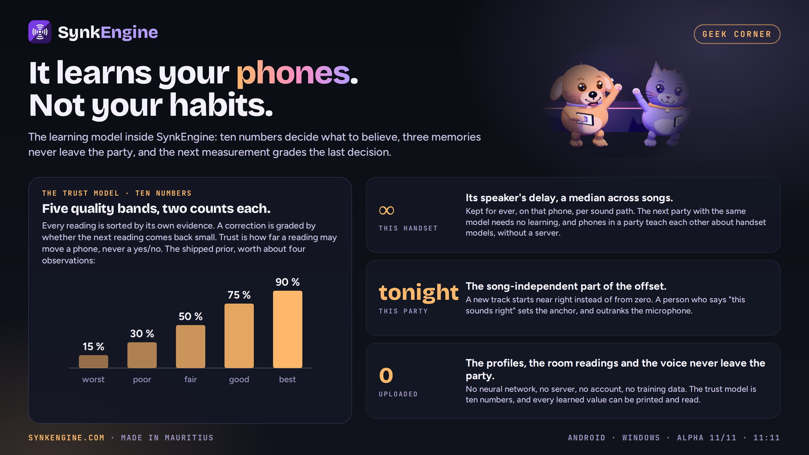

# It learns your phones, not your habits

*The learning model inside SynkEngine: ten numbers that decide what to believe, three memories that never leave the party, and why that beat a neural network on the arithmetic.*



---

One evening in August, a test party played a 24-minute film across a few phones, and one of them sent back nine readings of how far out of step it was:

```
−107, −56, −44, −41   |   +99, −118, −201, +116, +272   (ms)
     the music        |         quiet dialogue
```

The first four are a system closing in: 107, 56, 44, 41. Then the film reaches a stretch of dialogue with no beat in it, the correlation has nothing to lock onto, and the readings turn to noise. The app of that week believed every one of them, in full. Replayed against those exact numbers, that left the phone 407 ms wrong at its worst, and only one round in nine that you could listen to.

Every obvious fix was tried on that sequence before anything was built. Damp each correction to half: 173 ms at worst. Damp to 0.15: 49 ms at worst, but only five rounds of nine listenable, because it slows the good readings exactly as much as the bad. Median of the last five: 131 ms, because by the end the garbage is the majority, and a median only rescues you while the bad readings are outnumbered.

The version that worked was wrong by 61 ms at worst and right in eight rounds of nine. It did not filter the readings harder. It learned which readings deserved to be believed. That night is the reason SynkEngine has a learning model, and it is the reason the model looks nothing like what people expect one to look like.

## What there is to learn

SynkEngine plays one song on every phone in a room at the same instant, over the room's own Wi-Fi, with no server and no account. Past about 40 ms of spread the ear stops hearing several speakers and starts hearing an echo, so the target is a handful of milliseconds across handsets nobody chose, on a hotspot somebody is streaming video through.

The obvious method, agree on a clock and start together, fails, and it took eight releases to understand why. A streaming player reports its position to about a quarter of a second, so two phones both saying `01:23.4` can be 400 ms apart. Every handset has its own output latency, decoder to air, different again with Bluetooth in the path. Every song buffers differently, so the same track starts at a different offset each time it loads. And the room is in the loop: two phones two metres apart are 6 ms apart by physics before anything digital happens.

Two of those causes look identical from the outside, and confusing them caused most of this app's failure history. What a phone is out by is a sum:

```
error = (playerPos_i − playerPos_r) − (outLatency_i − outLatency_r)
        └──── changes every song ────┘   └── a property of the sound path ──┘
```

The left term moves every time a video loads. The right term is the phone's decoder and speaker, and it does not care what is playing. That is the one structural idea in the whole system: **learn the right term once, per handset and per sound path, and never learn it again; re-measure only the left term, per song.** Keep them in separate variables and a person's careful hand-tuning can never be silently overwritten by a buffering artefact.

Nothing in that paragraph needs learning. What needs learning is deciding **which measurements to believe**, because the only sensor available lies.

## One sensor, and it lies in a specific way

The only ground truth in a room is a microphone. In short listening rounds every phone records a few seconds of the room while the music keeps playing, reduces it to a loudness curve (one value per 5 ms, sharpened onto note attacks, about a kilobyte) and sends the curve. The host slides the curves against each other; the lag at the correlation peak is the raw error, with decoder, buffer, speaker and air included, because it was measured in the room. The audio itself is discarded on the phone.

That sensor is wrong often, and adversarially. If two phones already overlap, each microphone hears both speakers, and a repetitive track gives the correlation three peaks: the truth, a phantom at zero lag with twice the crosstalk's weight, and a mirror. Above 50 % crosstalk the phantom is the tallest peak, and it says *you are already in sync*. Three builds shipped believing it. And here is a field trace of six consecutive readings of one phone, no phantom involved: **434, 442, 350, 405, 329, 426 ms**. A controller that acts on the first one oscillates forever. No single reading there is actionable; all six together are.

So the judgement cannot be made downstream of the measurement, by filtering. It has to be made *about* the measurement.

## The trust model is ten numbers

Every reading now carries evidence about itself: how strongly the recordings correlated, how much the loudness actually moved, how featureless the passage was, and how well the three overlapping slices of the recording agreed with one another. That evidence sorts the reading into one of five quality bands.

Whether a band's readings are worth acting on is not guessed at. **The next reading grades the last one.** Apply a correction; if the following measurement comes back inside 45 ms, that correction was right, and the band that proposed it earns a point. If it comes back large, the band loses one. Each band keeps two counts, good and bad, under a Beta-Bernoulli prior:

```java
private static final double[] PRIOR_A = { 0.6, 1.2, 2.0, 3.0, 3.6 };
private static final double[] PRIOR_B = { 3.4, 2.8, 2.0, 1.0, 0.4 };
```

That is the model. Two arrays of five: ten numbers. The prior is sloped on purpose, from about 15 % trust for the worst band to 90 % for the best, and it is deliberately weak, worth about four observations, so a handful of real examples overrule it. The update is conjugate, so it is exact. There is no learning rate. It cannot diverge. When it has seen nothing it degrades to the prior. The build that introduced it printed the learner's own opinion of its five bands on a grey line under the seek bar, `trust by quality: 15% 30% 50% 80% 90%` for example, and the line changed as it watched: if the bottom band had dropped and the top band had risen by the end of a party, it had worked out which of its own readings were worth anything.

The part that turned 407 ms into 61 was not the counts. It was what trust is mapped onto. Trust is not a yes/no gate; it is **how far a reading is allowed to move the phone**. A low-trust reading still counts, a little. A run of them cannot take the party anywhere: fed 25 worthless readings in a row, the learner moves a phone by at most 70 ms in total. Fed honest ones, it has the party together by round two.

A logistic regression over ten features was costed for the same job, about 70 lines, a clean fit on paper. The sample size killed it. One party produces a few dozen labelled examples, and ten free parameters against a few dozen examples is the regime where a model is dominated by its own prior and does not reliably beat a well-chosen rule. That would be a learner that learns nothing and claims to. Ten numbers is a design decision defended on sample size, and saying the number out loud made the rest of the design easier.

## Three memories, three lifespans

The trust model is what decides. What the app *keeps* is separate, and every item of it is a number you can print and read.

| Memory | About | Lives | What it buys |
|---|---|---|---|
| The handset | one model of phone, on one sound path (speaker, Bluetooth, the boost chain) | for ever, on that phone | the constant term. The next party with the same model needs no learning |
| The party | tonight's phones | this session, across songs | the song-independent part of the offset. A new track starts near right instead of from zero |
| The room | tonight's room | this session | the room's spectral balance and decay, read from the same recording, so it costs nothing extra |

This is why the second party is faster than the first, and the third song faster than the first song; it is the most demonstrable claim in the product, provable on video with a stopwatch.

**What a phone keeps about its own speaker is a median, not an average, and that is the whole design.** The readings it has to survive are not gently noisy; occasionally one is wrong by a whole bar. An average is dragged toward every one of those and never fully recovers. A median ignores them as long as most readings are good, and it refuses any reading more than 400 ms from what it already believes while still following a genuine, sustained change. Before this memory existed, a queued song opened 467 ms out, then 121, then converged, every song, from scratch. The speaker had not changed. Only the app's knowledge of it had been thrown away.

**The human is a memory too.** There is a button that means *this sounds right, hold it*. From that moment the microphone's corrections are measured against the person's answer rather than the app's own prior: someone who has heard the room outranks a microphone that has heard four seconds of it. But a manual turn of the knob counts as a new belief, not as a confirmation. Searching is not deciding, and letting somebody's exploratory tuning feed the trust counts would poison them.

And there is a fourth instrument that made the microphone's job smaller. Since the left term of the error can be read straight out of each player, every phone stamps its own playback position on the party clock and reports it. Stamped, not measured on arrival: a report that dozes 300 ms in a Wi-Fi power-save queue still tells the truth when it lands. Against the microphone on the same scale, a listening round had a mean error of 94.8 ms and was usable 79 % of the time; the wire report, 1.1 to 6.3 ms and usable always, across rooms and on a hotspot. The microphone kept the job only it can do, the handset's own delay, remembered per phone as a median across songs. That is the two-term equation again, with an instrument on each side of the minus sign.

## Believing is mostly refusing

With trust in hand the app still needs a policy for acting, and every clause of it exists because a real party broke a version without it.

- **Agreement before action.** A correction needs four readings, agreeing within 140 ms, at a confidence above 0.35. The six readings above build the belief; none of them triggers a move.
- **A deadband below the audible limit.** Nothing moves under 20 ms of error. Not 35, where a person begins to hear it: an estimate lags the truth and damped moves approach rather than arrive, so a floor at the limit parks the party just the wrong side of it.
- **Belief expires.** After 90 seconds, or when the variance of recent readings passes 200 ms², the app stops trusting its own estimate and goes back to listening. Confidence that does not decay is how a controller defends a wrong answer for ten minutes.
- **A rejection run changes the strategy, not the effort.** Sixty seconds of refused readings means the assumption is wrong, not that the room is noisy, so the search window widens instead of the same window being tried harder.
- **Held is not settled.** One release decided whether a round had achieved anything by searching its own human-readable report for the text `"→ moved"`. The next release reworded the report, and every round was silently classified as in sync while parties ran 400 ms apart. The fix was not a better string search. It was admitting that "nothing moved" answers three different situations, finished, everything refused, and not confident yet, and only the first is green. A round now emits counts that must add up, every phone heard accounted for exactly once as moved, held or in place, and the decision is a pure function with no English near it:

```java
public boolean converged(long greenMs) {
    return measured > 0 && moved == 0 && held == 0 && gap <= greenMs;
}
```

Four clauses, four scars. It is the closest thing the app has to a conscience.

Even the sensor's timing was a lesson in trusting the wrong number. In September, every phone was found to open its listening window up to 93 ms late, so the phones misjudged their gap by 36 ms at the median. The window now opens on the recording's own timestamp rather than on the clock that asked for it, and the error is 0.7 ms.

## Phones teach each other, and nobody keeps score twice

What a phone learns about a handset model travels across the party. A phone that has never met your Samsung before, in a party where another phone has, starts from what the party already knows instead of from zero. The shared profile carries a mean and a variance rather than a bare number, because that is what lets two phones' estimates merge by inverse variance, the way two measurements with error bars should. The literature has a name for it: gossip learning, the published server-free cousin of federated learning.

The trap in it is real and silent. Phone A's estimate reaches C directly *and* through B, gets counted twice, and the table becomes confidently wrong while barely moving. Two defences, both cheap: every estimate is stamped with who measured it, so a repeat replaces rather than averages, and estimates from different phones merge by a rule that cannot become over-confident whatever their relationship. There is a test that fails if the same table arriving twice makes anyone more certain.

Say precisely what crosses the wire, because the precision is the point: statistics about models of telephone and about rooms. Never about people, never what was played, nothing that identifies a phone beyond its model name, and only to phones on the same local network in the same party. The sync data, the room measurements, the learned profiles and the singer's voice never leave the party. (Stream from YouTube and YouTube still knows what you played; that part is between you and them.)

## Why not a neural network: the arithmetic

The modern move is to put a small model in the app, and it was costed rather than dismissed.

- **Size.** The sync engine is a few hundred kilobytes of plain Java with no native code; the download is about 8 MB, and 6.9 MB of that is Mimi & Coco's dance frames. The smallest useful inference runtime is roughly 300 to 420 KB *per ABI*, about 680 KB of native code across two, before the model, the glue and a permanent maintenance obligation. With no native code, Google Play's 16 KB page-size requirement needs no work at all; one native library ends that for ever.
- **Privacy.** The lightweight route, the runtime supplied through Play Services, contacts Google. The product's promise is that the learned profiles stay in the party. Adding it would make the headline claim false, and a false headline claim is a regulatory problem before it is a marketing one.
- **Data.** A learned model needs labelled examples of correct sync across handsets. No such dataset exists, and the only way to collect one is the telemetry the product exists to avoid.
- **Fit.** This is a low-dimensional estimation problem with known physics. An estimator with an explicit uncertainty model is not a downgrade here; it is the correct tool, it is auditable, and every bad decision it makes can be explained.

The honest twist is that size was never the real argument. A network of 161 weights, 8 inputs to 16 to 1, is 644 bytes of generated Java and thirty lines of loops; it would fit in a rounding error. It still was not built, because the sample-size argument and the data argument survive the size argument intact. The generalisable form: **models are cheap now; judgement isn't.** When the problem is low-dimensional and the physics are known, the parameter count buys nothing and costs your privacy story and your ability to explain yourself.

The door was left open with discipline rather than enthusiasm. The feature vector has eight slots and three are deliberately unused; the stored state is versioned, so a future build can learn from more without any phone throwing away what it knows; and a rule stands that nothing learned reaches durable state unleashed: bound how far any observation, or any peer, may move a persisted belief, and keep an exact reset to the shipped prior. The one thing that will never be learned online is the twenty-odd hand-tuned constants. A bad party would write a bad constant to storage, the estimator would then defend it, and there would be no non-measuring path back.

## The same discipline reached karaoke

When SynkEngine turned the phones into a karaoke system, the singer's phone became the microphone and every other phone the speaker, and a new quantity needed learning: not the party's delay, but when the room actually plays the singer's voice. The singer's phone measures it at the first quiet moment of a turn with a soft half-second sweep, 10 dB under the voice's level, recorded by its own microphone on the party's clock. A reading must agree with itself, each half of the sweep finding the same arrival, or it is refused; that one rule took false readings, from a singer starting to sing inside the check, from 56 to 2 in 600 rooms while keeping every real one. One reading is used as it is, two that agree are averaged, and from three onward the median of the last three, so one odd reading moves nothing. It re-checks only at a real pause, at most once every 90 seconds and three times a turn, and only while the readings disagree or the party's phones have changed.

The trap it avoided is the same trap as everywhere else. One build remembered a singer's "louder" taps as a permanent setting, so a singer who had once tapped twice started every later turn at the level that howled in all five field rooms. Now the saved setting moves only the target; a louder tap lifts the ceiling for this turn alone. A memory that can ratchet is a memory that will.

## Tested against its own history

With no large model to blame, a regression is unambiguously a logic error, and a room full of people will find it before a metric does. So every behaviour is a unit test on the host JVM, off the phone, named after the failure it prevents:

- *a party with honest readings is together by round 3*
- *believing every reading leaves the phone 350+ ms out at worst*
- *refusing to measure is not the same as being in sync*
- *the learning survives a round trip through storage*
- *state from a version it does not understand falls back to the prior, and so does nonsense*
- *the same profile table arriving twice makes nobody more certain*

The test corpus is the field traces themselves: the nine readings above, the six from the crowded evening, the seven from a second night with four forming a 13 ms cluster and three mis-locks. When someone proposes loosening a threshold, the test that fails tells them which evening they are re-living. Every fix is pinned by a test that was watched to fail on the old code; constants are swept, not argued. And every release breaks its own fixes on purpose, one at a time, to prove a test catches each: 234 of 234 in v6.54, 188 of 188 in v6.55. Every mechanism also gets an anti-case, the input that must *not* trigger it: a fine phone on a table, a quiet passage that is genuinely quiet, a dead room in which every claimed howl would be false.

The same maths runs in two languages, Java on Android and Go on Windows, and a JVM oracle runs the unmodified Android classes and the Go port on the same cases and diffs the answers. Identical.

## What it is not

Stated plainly, because the temptation to overclaim here is enormous and the penalty is severe.

It is not self-aware and it is not conscious; it has an uncertainty model, which is a different thing. It does not use deep learning. It does not do room correction in the audiophile sense, which needs a calibrated microphone and a listener who stays in one seat; a party has neither. And it never sends anything anywhere: the flight recorder that logs a party has no network code in the file at all.

## Why it is special

Every other multi-phone audio app surveyed in August synchronises by agreeing on a clock. None of them measures what the room actually hears, none models its own uncertainty, and none made an adaptive claim in its store listing. That is not a marketing accident. Closing the loop through a microphone is hard, and every mechanism above is something you only discover by shipping and failing in front of people. The correlation maths is a textbook algorithm. The moat is the refusals: the phantom peak, agreement before action, held versus settled, the expiring belief, the rejection run, the inaudible correction, and a human override the machine learns from. Each is a scar from a party that did not work, and there is no shortcut to acquiring them.

So the learning model in SynkEngine is special for reasons that have nothing to do with size. It learns properties of hardware and rooms, so there is nothing about a person to upload. It is supervised by physics, not by labels: the next measurement grades the last decision. It can be printed on one screen and read. It abstains, and says so, instead of being confidently wrong. It learns socially, phone to phone, without a server and without counting anyone twice. And it defers to a human ear, then learns from it.

None of that needs a GPU. Most of it was not invented here; it is control theory and Bayesian statistics wearing party clothes. What is new is only that all of it was needed at once, on a phone, in a room, and that doing it turned out to be easier than it looks once you accept that the intelligence lives in the decision structure rather than in the parameter count.

It learns your phones. Not your habits.

---

*SynkEngine, built in Mauritius. Android and Windows now; iPhone on its way. Alpha 11/11 at 11:11, launch 12/12 at 12:12. The engineering notes: [synkengine.com/how-it-works](https://synkengine.com/how-it-works/?ref=github) · the geek corner on [LinkedIn](https://www.linkedin.com/company/synkengine)*

*Provenance of the numbers: the nine-reading trace, the 407/61 ms comparison, the six-reading trace and the 467/121 ms song start are field logs replayed off-device; the 94.8 versus 1.1–6.3 ms comparison was measured on the same phones on the same scale; the 93/36/0.7 ms window fix, the 234/234 and 188/188 mutation runs and the karaoke room check's 56 → 2 of 600 are from the project's benches.*
