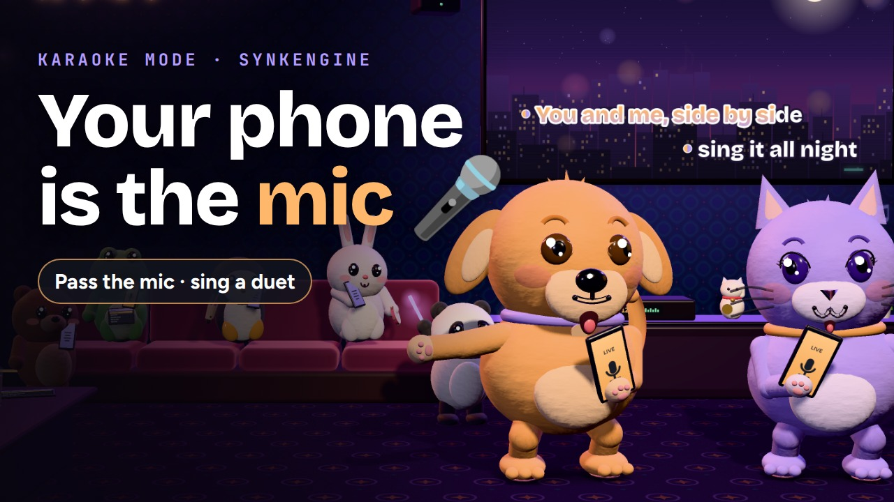

  

# SynkEngine

**Every phone in the room becomes one speaker.** SynkEngine plays the same song on every phone in the room at the same instant, over your own Wi-Fi, so a table of phones sounds like one big speaker. It also plays movies and anime in sync, merges up to four phones into one bigger screen, and turns the phones into a karaoke system. Android and Windows now; iPhone is on its way.

- **Alpha:** 11/11 at 11:11 · **Official launch:** 12/12 at 12:12 (Mauritius, GMT+4)
- **The first 108 requests get lifetime access, free:** [synkengine.com](https://synkengine.com/?ref=github)

## 🎤 Karaoke Mode is out

Your phone is the mic. Every other phone in the room is the speaker, and the voice and the song play in sync on all of them. Pass the mic, sing a duet, and the lyrics follow on the big screen. The 46-second film: [on YouTube](https://youtu.be/rfW2XavS0_g) · [the page, with the transcript](https://synkengine.com/karaoke/?ref=github) · [the Short](https://youtube.com/shorts/K5O9wmlc30M)

## Our official links

Please be careful of scammers. We use the same name everywhere: **synkengine**. Anything else isn't us.

| | |
|---|---|
| **Websites** | [synkengine.com](https://synkengine.com/?ref=github) (main) · synkengine.net · synkengine.org |
| **Socials** | [Facebook](https://www.facebook.com/SynkEngine) · [TikTok](https://www.tiktok.com/@synkengine) · [YouTube](https://www.youtube.com/@SynkEngine) · [Instagram](https://www.instagram.com/synkengine/) · [X](https://x.com/SynkEngine) |
| **Geek corner** | [LinkedIn](https://www.linkedin.com/company/synkengine) · [GitHub](https://github.com/SynkEngine) |

The app is only handed out through the request form on [synkengine.com](https://synkengine.com/?ref=github).

## The geek corner

What we work on, and write about on [LinkedIn](https://www.linkedin.com/company/synkengine):

- **Clock sync and acoustic measurement on ordinary phones.** The phones agree on one party clock, then keep checking what the room actually hears: in short listening rounds, each phone's microphone turns the music into a coarse loudness curve, so the host can measure how far apart the speakers really are and move the late ones back into step.
- **Karaoke over Wi-Fi**, with a latency budget measured in milliseconds.
- **Two apps tested against each other:** an Android app (Java) and a Windows app (Go).
- **Mutation tests, soak tests and adversarial reviews.**
- **Built in Mauritius** by one person working with two AI models.

**The articles:** [It learns your phones, not your habits](LEARNING-MODEL.md), the learning model inside SynkEngine: ten numbers that decide what to believe, three memories that never leave the party, and why that beat a neural network on the arithmetic (15 min).

## How it works, for engineers

  

No server, no account. The phones find each other on the Wi-Fi and agree on one party clock (a small NTP-style exchange with the host). Then the real work starts, because every phone's speaker runs late by a different amount, and the amount changes with the song. Five ideas carry the app:

1. **Measure the air, not the network.** In short listening rounds, every phone records its own microphone over the same seconds of party time while the music plays, reduces it to a loudness curve (one value per 5 ms, about 1 kB) and sends the curve. The host cross-correlates the curves; the lag is the true gap between two speakers, with decoder, buffer, speaker and room included. The audio is discarded on the phone.
2. **The phantom peak.** Two phones near each other hear both speakers. With crosstalk `g`, the correlation is `R(τ) = R_a(τ−d) + 2g·R_a(τ) + g²·R_a(τ+d)`: the truth, a phantom at zero that grows twice as fast as the crosstalk, and a mirror. Above `g = 0.5` the phantom is the tallest peak. It is narrow and sits at zero, so it is recognised by shape and suppressed. At 60 % crosstalk: 14/120 correct before, 117/120 after.
3. **Never move on one reading.** Three overlapping slices per recording, the median wins (mean error on the hard case 246 → 170 ms). Windows that opened up to 93 ms late gave a 36 ms median error; opening them on the recording's own timestamp (`MicWindow`, v6.54) gives 0.7 ms.
4. **Two quantities, two instruments.** What a microphone hears is the sum of where each player is (changes every song) and how late the handset's speaker is (a property of the phone). Each phone timestamps its own playback position on the party clock and reports it; the report is timestamped, not measured on arrival, so a 300 ms doze in a Wi-Fi power-save queue costs nothing. Mean error 1.1–6.3 ms versus 94.8 ms for a microphone round. The microphone keeps the handset's own delay, remembered per phone as a median across songs.
5. **One maths, two languages.** Android in Java, Windows in Go. A JVM oracle runs the unmodified Android classes and the Go port on the same cases and diffs the answers: identical. Every v6.54 fix is broken on purpose to prove a test catches it (234/234); a 180 s soak test runs 2,245 actions.

**Karaoke over Wi-Fi:** the singer's phone is the mic, every other phone is the speaker, 120–190 ms from voice to room (capture 20–40, frame 20, network 2–10, jitter buffer 60, output 20–60). The singer's own phone plays the song at 20 %, early by the party's voice delay, so the singer lands on the room's beat. Feedback is fixed at its root, a 0 dB start ceiling, not with an adaptive canceller: the listening phones' clocks drift, and 0.18 ms of creep turns the phase at 5.7 kHz through a whole cycle, so a canceller would chase its own model. On a bench of three model rooms: 38.1 / 8.4 / 32.4 seconds of howl per minute of singing without a guard, 0.0 / 0.0 / 0.0 with it.

The film with the transcript: [synkengine.com/karaoke](https://synkengine.com/karaoke/?ref=github) · How it works in 57 seconds: [synkengine.com/how-it-works](https://synkengine.com/how-it-works/?ref=github)

The app's source code is private.

© 2026 SynkEngine
